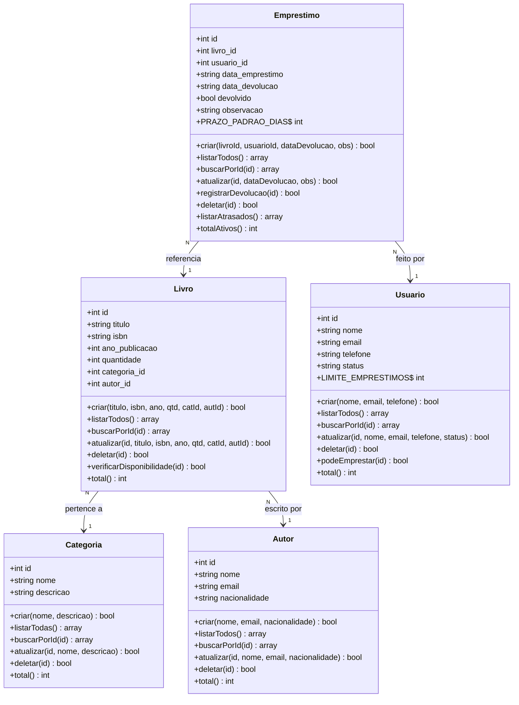

# 📚 Sistema de Gerenciamento de Biblioteca

Sistema web desenvolvido em **PHP 8+** com **MySQL**, utilizando orientação a objetos e padrão MVC simplificado. Permite o controle completo do acervo de uma biblioteca: cadastro de livros, autores, categorias, usuários e gerenciamento de empréstimos.

---

## 🗂️ Estrutura do Projeto

```
biblioteca/
├── config/
│   ├── database.php       # Configuração PDO da conexão com MySQL
│   └── layout.php         # Funções de layout, alertas e redirecionamento
├── classes/
│   ├── Categoria.php      # Classe de categorias dos livros
│   ├── Autor.php          # Classe de autores
│   ├── Livro.php          # Classe do acervo de livros
│   ├── Usuario.php        # Classe de membros/usuários da biblioteca
│   └── Emprestimo.php     # Classe de empréstimos e devoluções
├── pages/
│   ├── categorias/        # CRUD de categorias
│   ├── autores/           # CRUD de autores
│   ├── livros/            # CRUD de livros
│   ├── usuarios/          # CRUD de usuários
│   └── emprestimos/       # CRUD de empréstimos + devolução
├── database.sql           # Script SQL completo
└── index.php              # Dashboard principal
```

---

## ⚙️ Requisitos

- PHP 8.1+
- MySQL 8.0+ (ou MariaDB 10.6+)
- Servidor web: Apache / Nginx (ou `php -S localhost:8000`)
- Extensão PDO e pdo_mysql habilitadas

---

## 🚀 Instalação

**1. Clone ou copie a pasta `biblioteca/` para o seu servidor web.**

**2. Crie o banco de dados:**
```bash
mysql -u root -p < database.sql
```

**3. Configure a conexão em `config/database.php`:**
```php
define('DB_HOST', 'localhost');
define('DB_NAME', 'biblioteca_db');
define('DB_USER', 'root');
define('DB_PASS', 'sua_senha');
```

**4. Acesse no navegador:**
```
http://localhost/biblioteca/
```

> Para desenvolvimento rápido com PHP built-in server:
> ```bash
> php -S localhost:8000 -t biblioteca/
> ```

---

## 📋 Classes e Operações CRUD

| Classe        | Criar | Listar | Buscar | Atualizar | Deletar | Extra                          |
|---------------|:-----:|:------:|:------:|:---------:|:-------:|-------------------------------|
| `Categoria`   | ✅    | ✅     | ✅     | ✅        | ✅      | Proteção: livros vinculados    |
| `Autor`       | ✅    | ✅     | ✅     | ✅        | ✅      | Proteção: livros vinculados    |
| `Livro`       | ✅    | ✅     | ✅     | ✅        | ✅      | Verificação de disponibilidade |
| `Usuario`     | ✅    | ✅     | ✅     | ✅        | ✅      | Controle de status ativo/inativo |
| `Emprestimo`  | ✅    | ✅     | ✅     | ✅        | ✅      | Devolução, detecção de atraso  |

---

## 📐 Diagrama de Classes



---

## 📏 Regras de Negócio

### Livros
- A **quantidade** de exemplares deve ser mínimo **1**.
- Um livro só pode ser **excluído** se não houver empréstimos ativos vinculados a ele.
- Antes de registrar um empréstimo, o sistema verifica a **disponibilidade** de exemplares (total cadastrado − exemplares emprestados).

### Usuários
- O **e-mail** deve ser válido e único no sistema.
- Um usuário **inativo** não pode realizar novos empréstimos.
- Cada usuário pode ter no máximo **3 empréstimos simultâneos** (`Usuario::LIMITE_EMPRESTIMOS`).
- Um usuário só pode ser **excluído** se não tiver empréstimos ativos.

### Empréstimos
- O **prazo padrão** de devolução é de **14 dias** (`Emprestimo::PRAZO_PADRAO_DIAS`).
- A **data de devolução** não pode ser retroativa (anterior ao dia atual).
- Um empréstimo só pode ser **excluído** após a devolução ser registrada.
- Empréstimos com prazo vencido e não devolvidos são marcados como **"Em Atraso"** e destacados em vermelho na interface.

### Categorias e Autores
- Uma categoria ou autor só pode ser **excluído** se não houver livros vinculados a ele (integridade referencial).

---

## 🛠️ Tecnologias Utilizadas

| Tecnologia       | Uso                                      |
|------------------|------------------------------------------|
| PHP 8.1+         | Back-end, orientação a objetos, PDO      |
| MySQL 8.0        | Banco de dados relacional                |
| Bootstrap 5.3    | Interface responsiva                     |
| Bootstrap Icons  | Ícones da interface                      |
| PDO              | Abstração segura de banco de dados       |

---

## 🔒 Segurança

- Todas as queries utilizam **prepared statements** (PDO) para prevenir SQL Injection.
- Saída de dados sempre com `htmlspecialchars()` para prevenir XSS.
- Validações realizadas tanto no front-end (HTML5) quanto no back-end (PHP).
