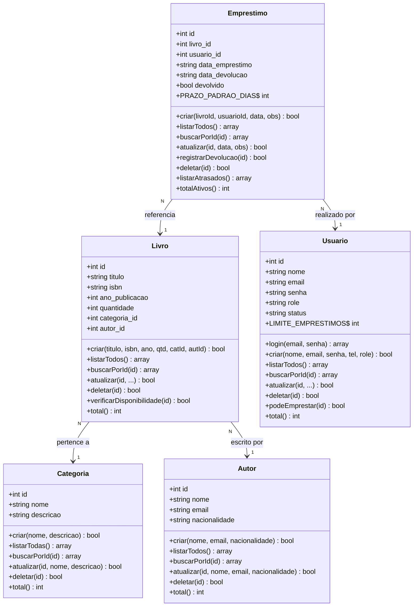

# 📚 BiblioSys — Sistema de Gerenciamento de Biblioteca

> Projeto Final — Sistema Web em PHP com MySQL

---

## 📋 Descrição do Sistema

O **BiblioSys** é um sistema web completo de gerenciamento de biblioteca desenvolvido em **PHP 8** orientado a objetos com banco de dados **MySQL**. O sistema permite o controle do acervo de livros, cadastro de autores e categorias, gerenciamento de usuários e todo o ciclo de empréstimos e devoluções.

O sistema possui dois perfis de acesso distintos:

- **Administrador** — acesso completo ao gerenciamento do acervo, usuários e empréstimos
- **Leitor** — acessa o catálogo, solicita empréstimos e acompanha seus próprios livros

---

## 🛠️ Tecnologias Utilizadas

| Tecnologia | Versão | Uso |
|---|---|---|
| PHP | 8.1+ | Back-end, OOP, PDO |
| MySQL | 8.0+ | Banco de dados relacional |
| Bootstrap | 5.3 | Interface responsiva |
| Bootstrap Icons | 1.11 | Ícones da interface |
| Apache | XAMPP | Servidor web local |

---

## 📐 Diagrama de Classes



---

## 🗂️ Estrutura do Projeto

```
biblioteca/
├── config/
│   ├── database.php          # Configuração PDO (não versionado)
│   ├── database.example.php  # Modelo de configuração
│   ├── auth.php              # Controle de sessão e roles
│   └── layout.php            # Funções de interface (header, footer, alertas)
│
├── classes/
│   ├── Categoria.php         # CRUD de categorias
│   ├── Autor.php             # CRUD de autores
│   ├── Livro.php             # CRUD de livros + disponibilidade
│   ├── Usuario.php           # CRUD de usuários + autenticação
│   └── Emprestimo.php        # CRUD de empréstimos + devolução
│
├── pages/
│   ├── categorias/           # Interface admin: categorias
│   ├── autores/              # Interface admin: autores
│   ├── livros/               # Interface admin: livros
│   ├── usuarios/             # Interface admin: usuários
│   ├── emprestimos/          # Interface admin: empréstimos
│   └── usuario/              # Interface do leitor
│       ├── dashboard.php     # Página inicial do leitor
│       ├── catalogo.php      # Catálogo com filtros
│       ├── solicitar.php     # Solicitar empréstimo
│       └── meus-emprestimos.php # Histórico pessoal
│
├── login.php                 # Tela de login
├── cadastro.php              # Tela de cadastro
├── logout.php                # Encerrar sessão
├── index.php                 # Dashboard do administrador
├── database.sql              # Script completo do banco de dados
└── setup.php                 # Utilitário de reset de senhas (opcional)
```

---

## ⚙️ Instalação e Configuração

### Pré-requisitos

- [XAMPP](https://www.apachefriends.org/) (Apache + MySQL) ou equivalente
- PHP 8.1 ou superior
- MySQL 8.0 ou MariaDB 10.6+

### Passo a Passo

**1. Clonar o repositório**
```bash
git clone <url-do-repositorio>
```
Copie a pasta `biblioteca/` para dentro de `C:\xampp\htdocs\`.

**2. Configurar o banco de dados**

Abra o phpMyAdmin (`http://localhost/phpmyadmin`) e execute o arquivo `database.sql`.

Ou via linha de comando:
```bash
mysql -u root -p < database.sql
```

**3. Configurar a conexão**

Copie o arquivo de exemplo e ajuste suas credenciais:
```bash
cp config/database.example.php config/database.php
```

Edite `config/database.php`:
```php
define('DB_HOST', 'localhost');
define('DB_NAME', 'biblioteca_db');
define('DB_USER', 'root');
define('DB_PASS', '');   // sua senha MySQL (vazio no XAMPP padrão)
```

**4. Acessar o sistema**
```
http://localhost/biblioteca/
```

---

## 🔑 Usuários Padrão

Criados automaticamente pelo `database.sql`:

| Perfil | E-mail | Senha | Acesso |
|---|---|---|---|
| 🛡️ Administrador | `admin@biblioteca.com` | `admin123` | Painel completo |
| 📚 Leitor | `joao@email.com` | `user123` | Catálogo e empréstimos |
| 📚 Leitor | `maria@email.com` | `user123` | Catálogo e empréstimos |

---

## 📏 Regras de Negócio

### Autenticação e Roles
- Autenticação via sessão PHP com `password_hash()` / `password_verify()`
- Role **admin**: gerencia todo o sistema
- Role **usuario**: visualiza catálogo e solicita empréstimos
- Páginas protegidas redirecionam para login se não autenticado
- Admin acessando área de usuário é redirecionado para o painel admin

### Livros
- Quantidade mínima de **1** exemplar por título
- Disponibilidade calculada em tempo real: `total − emprestados`
- Livro não pode ser excluído com empréstimos ativos

### Usuários
- E-mail deve ser único e válido
- Usuário **inativo** não pode realizar empréstimos
- Limite de **3 empréstimos simultâneos** por leitor
- Usuário com empréstimos ativos não pode ser excluído

### Empréstimos
- Prazo padrão de **14 dias**
- Data de devolução não pode ser retroativa
- Empréstimos vencidos são sinalizados em vermelho como **"Em Atraso"**
- Exclusão de empréstimo só permitida após devolução registrada

### Categorias e Autores
- Só podem ser excluídos se não houver livros vinculados

---

## 🔒 Segurança

- **SQL Injection**: todas as queries usam *prepared statements* via PDO
- **XSS**: toda saída de dados usa `htmlspecialchars()`
- **Senhas**: armazenadas com `password_hash(PASSWORD_BCRYPT)`
- **Controle de acesso**: verificação de sessão em todas as páginas

---

## 📊 Classes e Operações CRUD

| Classe | C | R | U | D | Extra |
|---|:---:|:---:|:---:|:---:|---|
| `Categoria` | ✅ | ✅ | ✅ | ✅ | Proteção por vínculo com livros |
| `Autor` | ✅ | ✅ | ✅ | ✅ | Proteção por vínculo com livros |
| `Livro` | ✅ | ✅ | ✅ | ✅ | Verificação de disponibilidade |
| `Usuario` | ✅ | ✅ | ✅ | ✅ | Login, roles, limite de empréstimos |
| `Emprestimo` | ✅ | ✅ | ✅ | ✅ | Devolução, detecção de atraso |
